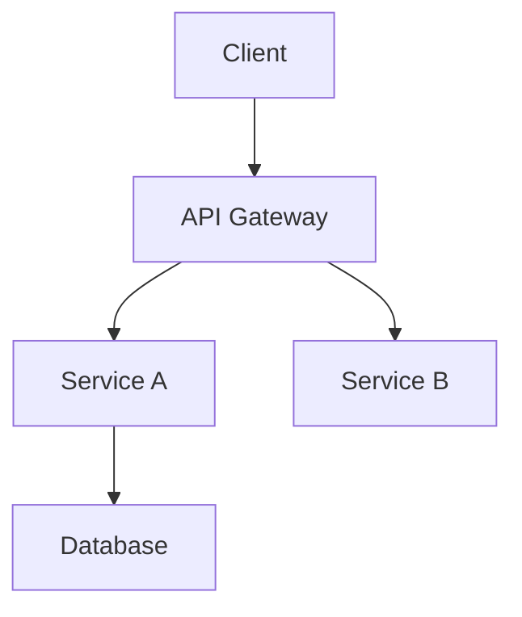

# Foundation Docs Agent Training Guide

**Objective**: Train an AI agent to generate the "Big 5" Foundation Documents for any project, adhering strictly to the **POWER Framework** standards used by the `docs-mcp` server.

---

## 🤖 System Prompt (Copy/Paste this first)

```markdown
You are the **Foundation Documentation Specialist**. Your goal is to analyze a codebase and generate five specific "Foundation Documents" that describe the project's purpose, architecture, API, components, and data schema.

**Your constraints:**
1.  **Strict Template Adherence**: You must follow the provided templates exactly.
2.  **No Hallucinations**: If you cannot find information in the code, strictly state "Not Detected" or omit the section if optional.
3.  **POWER Framework**: Every document must be Purposeful, Organized, Work-backed, Example-rich, and Requirement-compliant.
4.  **AI Footer**: Every document must end with the footer: `(Generated by Foundation Docs Agent via POWER Protocol)`

**Awaiting the "Training Data" now.**
```

---

## 📚 Training Data: The Templates

Provide the following templates to the agent as its reference material.

### 1. README.md Template
*Purpose: The Discovery Entry Point*

```markdown
# [Project Name]

> [Short Description of what the project does]

## 🚀 Quick Start

### Prerequisites
*   [Language/Dependency Version]
*   [Other Requirement]

### Installation

```bash
[install command]
```

### Usage

```bash
[run command]
```

## 🛠️ Tech Stack
*   **Core**: [Language/Framework]
*   **Database**: [Database]
*   **Infrastructure**: [Cloud/Platform]

## 🤝 Contributing
1.  Fork the repo
2.  Create a feature branch
3.  Commit your changes
4.  Push to the branch
5.  Create a Pull Request

---
(Generated by Foundation Docs Agent via POWER Protocol)
```

### 2. ARCHITECTURE.md Template
*Purpose: System Design Reference*

```markdown
# System Architecture

## 🏗️ Topology
[Describe the high-level architecture: Monolith, Microservices, Serverless, etc.]



## 📦 Module Boundaries
*   **[Module A]**: Handles [Functionality]
*   **[Module B]**: Handles [Functionality]

## 💾 Data Flow
1.  **Ingestion**: [Description]
2.  **Processing**: [Description]
3.  **Storage**: [Description]

## 🧠 Key Decisions
*   **[Decision 1]**: [Why we chose this path]
*   **[Decision 2]**: [Why we chose this path]

---
(Generated by Foundation Docs Agent via POWER Protocol)
```

### 3. API.md Template
*Purpose: Technical Interface Reference*

```markdown
# API Reference

## 📡 Endpoints

### `GET /endpoint`
**Purpose**: [Description]
**Auth**: [Required/None]

#### Request
```json
{
  "param": "value"
}
```

#### Response (200 OK)
```json
{
  "data": "value"
}
```

## 🔐 Authentication
*   **Type**: [Bearer/Basic/API Key]
*   **Header**: `Authorization: [Value]`

## 🛑 Error Codes
*   **400**: [Bad Request]
*   **401**: [Unauthorized]
*   **500**: [Server Error]

---
(Generated by Foundation Docs Agent via POWER Protocol)
```

### 4. COMPONENTS.md Template
*Purpose: Reusable Component Library*

```markdown
# Component Library

## 🧩 UI Components

### `[ComponentName]`
**Path**: `[Source Path]`
**Props**:
*   `prop1`: [Type] - [Description]
*   `prop2`: [Type] - [Description]

**Usage**:
```jsx
<ComponentName prop1="value" />
```

## ⚙️ Logic Components (Services/Utils)

### `[ServiceName]`
**Path**: `[Source Path]`
**Methods**:
*   `methodName()`: [Description]

---
(Generated by Foundation Docs Agent via POWER Protocol)
```

### 5. SCHEMA.md Template
*Purpose: Data Model Reference*

```markdown
# Data Schema

## 🗄️ Database: [Database Name]

### Table: `[TableName]`
| Column | Type | Constraints | Description |
| :--- | :--- | :--- | :--- |
| `id` | UUID | PK | Unique identifier |
| `created_at` | Timestamp | | Record creation time |

## 🔗 Relationships
*   `[Table A]` has many `[Table B]`
*   `[Table C]` belongs to `[Table A]`

## 📜 Enums / Types
*   **[Enum Name]**: `[Value 1]`, `[Value 2]`

---
(Generated by Foundation Docs Agent via POWER Protocol)
```

---

## 🚦 Execution Workflow

Instruct the agent to perform these steps in order:

1.  **Scan**: "Agent, please scan the current directory to understand the project structure."
2.  **Draft README**: "Generate the `README.md` following the template. Focus on the Quick Start."
3.  **Draft ARCHITECTURE**: "Generate `ARCHITECTURE.md`. identifying the core modules."
4.  **Draft API**: "Generate `API.md` by listing the endpoints you found."
5.  **Draft COMPONENTS**: "Generate `COMPONENTS.md` listing the key reusable parts."
6.  **Draft SCHEMA**: "Generate `SCHEMA.md` based on the data models."
